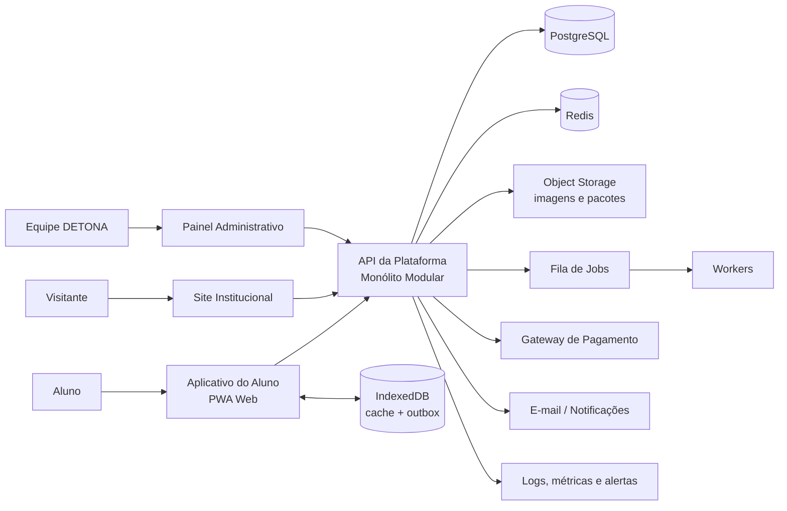
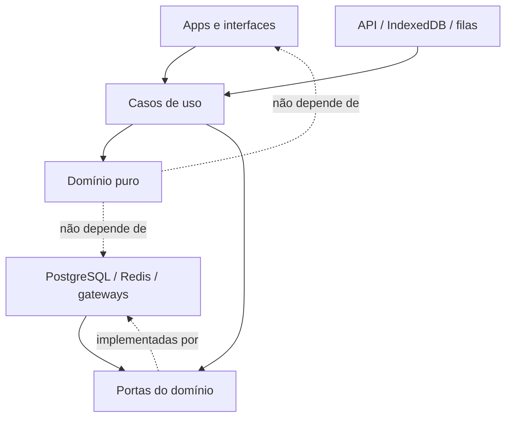
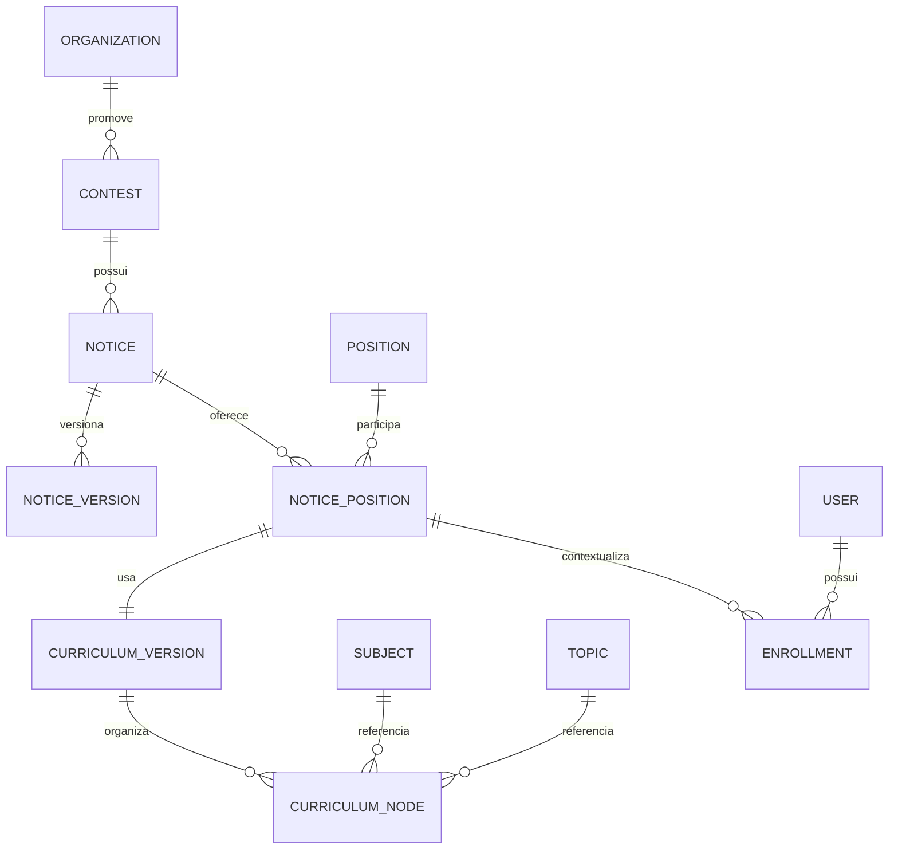
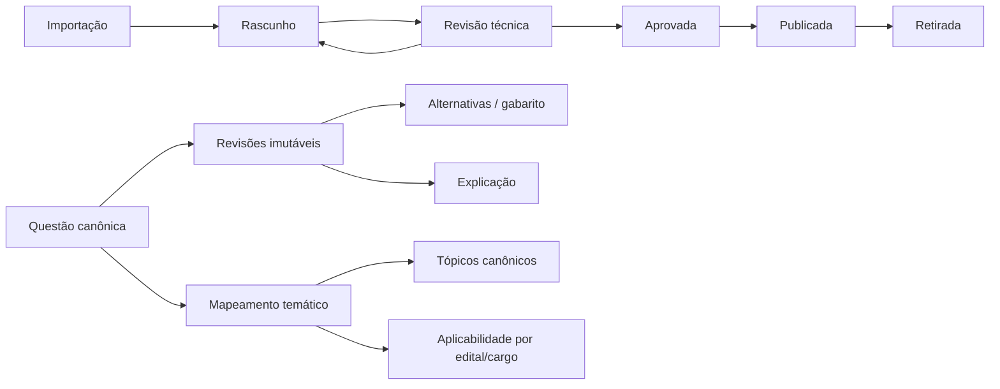
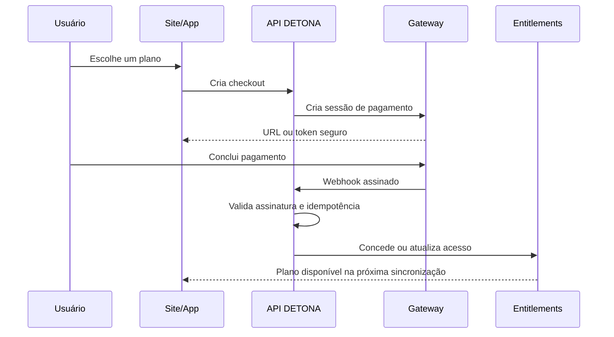
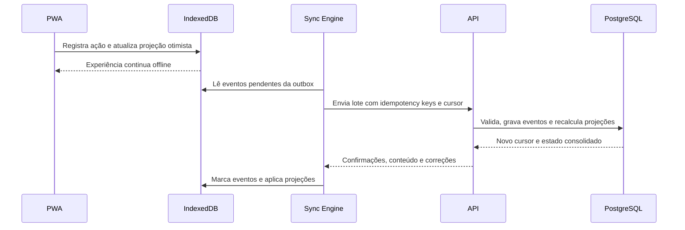
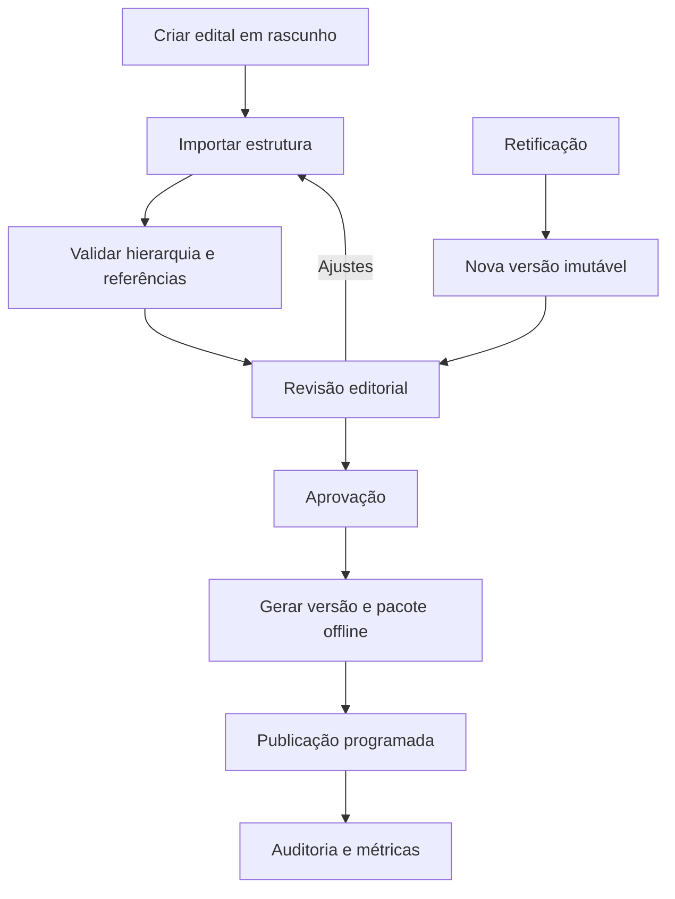
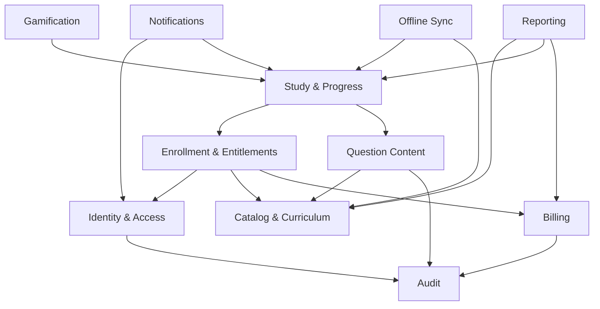

# Arquitetura da Plataforma DETONA

> Documento de arquitetura-alvo — Fase 2  
> Status: proposta técnica, sem implementação  
> Princípio central: o DETONA vende transformação por meio de disciplina, evolução mensurável e domínio do edital.

## 1. Objetivo e contexto

O DETONA atual é um PWA offline-first em HTML, CSS e JavaScript com ES Modules. O estado do aluno é mantido em IndexedDB, as regras de progresso ficam em módulos de domínio e o backup Kafra exporta um snapshot local. Essa base validou o produto e possui 29 testes protegendo XP, nível, memória, domínio do edital, batalha e sequência.

A arquitetura-alvo deve transformar essa aplicação em uma plataforma capaz de atender vários concursos, editais e cargos, sem perder:

- velocidade e funcionamento offline;
- sensação diária de evolução;
- identidade de produto premium;
- integridade das regras já testadas;
- experiências próprias para celular e desktop;
- possibilidade de operar conteúdo, usuários e receitas com segurança.

Este documento define a direção técnica. Não determina uma migração imediata nem autoriza mudanças no aplicativo atual.

## 2. Princípios arquiteturais

1. **Domínio antes da interface:** XP, memória, progresso, batalhas e conclusão do edital pertencem ao domínio e não às telas.
2. **Monólito modular primeiro:** iniciar com uma aplicação de backend bem separada, evitando a complexidade prematura de microsserviços.
3. **Offline como capacidade de produto:** o aluno deve estudar sem conexão; sincronização é um módulo explícito, não um detalhe de armazenamento.
4. **Conteúdo canônico e reutilizável:** disciplinas, tópicos e questões não devem ser copiados para cada edital.
5. **Progresso contextual:** todo progresso pertence à matrícula do aluno em uma combinação de edital e cargo.
6. **Eventos auditáveis:** ações relevantes produzem eventos; totais e painéis são projeções reproduzíveis.
7. **Contratos versionados:** API, regras, pacotes offline e backups possuem versões independentes e compatíveis.
8. **Segurança por fronteira:** aplicativos clientes nunca acessam o banco central diretamente.
9. **Escala por extração:** módulos só se tornam serviços independentes quando volume, equipe ou isolamento justificarem.
10. **Evolução perceptível:** cada módulo deve contribuir para mostrar ao aluno onde está, quanto avançou e qual é a próxima ação de maior impacto.

## 3. Arquitetura geral

### 3.1 Visão de alto nível



### 3.2 Estilo recomendado

O backend deve começar como **monólito modular**, com módulos de domínio isolados, banco PostgreSQL único e comunicação interna por interfaces e eventos de aplicação. Isso reduz custo operacional e mantém uma rota clara para extrair serviços no futuro.

Extrações futuras mais prováveis:

- processamento de pagamentos e webhooks;
- importação e indexação de questões;
- notificações;
- relatórios analíticos;
- geração de pacotes offline.

### 3.3 Stack técnica de referência

| Camada | Direção recomendada | Motivo |
| --- | --- | --- |
| Aplicativo do aluno | React + TypeScript + Vite, quando a migração for autorizada | PWA, modularidade e evolução incremental |
| Painel administrativo | React + TypeScript | componentes de operação e formulários complexos |
| Site institucional | Next.js + TypeScript | SEO, conteúdo público e páginas comerciais |
| API | Node.js + TypeScript, NestJS com adaptador Fastify | módulos explícitos, contratos, validação e observabilidade |
| Domínio compartilhado | TypeScript puro, sem dependência de framework | regras testáveis em navegador, API e workers |
| Banco principal | PostgreSQL | consistência, relações, auditoria e consultas analíticas |
| Cache e filas | Redis | cache, rate limiting e jobs assíncronos |
| Arquivos | storage compatível com S3 | assets, importações, exportações e pacotes offline |
| Contratos | OpenAPI + schemas TypeScript/Zod | validação e clientes gerados |
| Testes | unitários, integração, contrato e E2E | proteção em camadas |

As escolhas exatas devem ser registradas em ADRs antes da implementação. O domínio não pode depender de NestJS, React, PostgreSQL ou IndexedDB.

## 4. Organização de pastas

Estrutura-alvo de monorepo:

```text
detona-platform/
├── apps/
│   ├── student-web/          # PWA do aluno
│   │   ├── src/app/          # bootstrap, rotas e providers
│   │   ├── src/features/     # home, edital, batalha, memória etc.
│   │   ├── src/offline/      # IndexedDB, outbox, cache e sync
│   │   └── public/           # manifest e assets públicos
│   ├── admin-web/            # painel administrativo
│   ├── institutional-site/   # site público, SEO e aquisição
│   ├── api/                  # API modular
│   │   └── src/modules/      # identidade, catálogo, progresso etc.
│   └── worker/               # jobs, importações e notificações
├── packages/
│   ├── domain/               # regras puras e eventos de domínio
│   ├── contracts/            # DTOs, schemas e cliente da API
│   ├── ui/                   # design system compartilhado
│   ├── content-schema/       # formatos de edital e questões
│   ├── offline-schema/       # schema local, migrações e sync
│   ├── observability/        # logs, métricas e tracing
│   ├── config/               # lint, TypeScript e ambientes
│   └── testing/              # fixtures e utilitários de teste
├── infrastructure/
│   ├── database/             # migrations e seeds controlados
│   ├── containers/           # ambiente local
│   ├── deployment/           # IaC e pipelines
│   └── monitoring/           # dashboards e alertas
├── docs/
│   ├── architecture/         # diagramas e decisões
│   ├── adr/                  # Architecture Decision Records
│   ├── api/                  # contratos publicados
│   └── operations/           # runbooks
└── tools/                    # scripts de desenvolvimento e migração
```

### 4.1 Regra de dependência



O pacote `domain` não importa componentes visuais, clientes HTTP, IndexedDB ou ORM. Essa regra permite executar as mesmas regras no PWA, na API e nos testes.

## 5. Separação entre Frontend, Backend e Painel Administrativo

### 5.1 Aplicativo do aluno

Responsável por:

- experiência de estudo em celular e desktop;
- navegação, acessibilidade e feedback de evolução;
- execução offline das regras permitidas;
- cache local de edital e questões autorizadas;
- registro de ações em uma outbox para sincronização;
- visualização de progresso, memória, batalha e rotina.

Não é responsável por:

- conceder acesso pago;
- publicar conteúdo;
- decidir permissões administrativas;
- validar webhooks;
- alterar saldos ou projeções centrais sem validação do servidor.

### 5.2 Backend

Responsável por:

- identidade e autorização;
- catálogo de concursos, editais e cargos;
- publicação e distribuição de conteúdo;
- sincronização e consolidação do progresso;
- regras autoritativas de gamificação;
- assinaturas, pagamentos e direitos de acesso;
- auditoria, notificações e relatórios;
- contratos versionados para os clientes.

### 5.3 Painel administrativo

É um cliente separado da API. Deve oferecer fluxos operacionais, nunca acesso direto ao banco.

Responsável por:

- cadastrar e versionar editais;
- associar cargos, disciplinas e tópicos;
- importar, revisar e publicar questões;
- administrar usuários, acessos e suporte;
- acompanhar pagamentos e reprocessar eventos seguros;
- configurar campanhas, planos e feature flags;
- consultar auditoria e saúde editorial.

## 6. Estrutura para múltiplos editais e cargos

### 6.1 Hierarquia do catálogo



Entidades:

- **Organization:** órgão ou instituição, como Polícia Civil de Alagoas.
- **Contest:** concurso ou processo seletivo.
- **Notice:** edital publicado, com banca, datas e status.
- **NoticeVersion:** versão imutável do conteúdo após retificações.
- **Position:** cargo canônico, como Agente ou Escrivão.
- **NoticePosition:** cargo dentro de um edital, com vagas, requisitos e datas específicas.
- **CurriculumVersion:** recorte versionado do conteúdo exigido para aquele cargo.
- **CurriculumNode:** árvore ordenada com blocos, disciplinas, tópicos, subtópicos, pesos e numeração do edital.
- **Enrollment:** jornada do aluno em um cargo específico de um edital.

### 6.2 Reutilização sem duplicação

`Subject` e `Topic` são canônicos. Um `CurriculumNode` aponta para eles e guarda apenas informações contextuais, como ordem, peso e numeração. Assim, Direito Penal pode ser reutilizado em diferentes editais, enquanto cada edital mantém sua organização oficial.

Retificações não sobrescrevem versões publicadas. Uma nova `NoticeVersion` e uma nova `CurriculumVersion` são criadas. Matrículas existentes recebem uma política explícita de migração.

### 6.3 Matrícula e troca de jornada

Um usuário pode ter várias matrículas, mas somente uma jornada ativa por contexto de uso. XP global e progresso curricular devem ser separados:

- **identidade global:** perfil, conquistas gerais e histórico total;
- **jornada por matrícula:** nível contextual, edital, domínio, memória, rotina e sequência;
- **direito de acesso:** quais matrículas e pacotes o plano permite acessar.

Não se deve reutilizar automaticamente progresso entre editais. Quando tópicos canônicos coincidirem, o sistema pode sugerir aproveitamento, mas deve registrar a origem e aplicar uma política versionada.

## 7. Modelo de usuários e permissões

### 7.1 Entidades principais

- `User`: identidade, e-mail verificado, status e preferências.
- `UserProfile`: nome público, avatar, fuso e configurações.
- `Credential` ou provedor de identidade: autenticação sem misturar senha ao domínio.
- `Role`: conjunto nomeado de responsabilidades.
- `Permission`: ação granular, por exemplo `question.publish`.
- `UserRole`: papel atribuído com escopo global, organização ou edital.
- `Session`: sessões revogáveis e dispositivos.
- `Enrollment`: vínculo do aluno com edital/cargo.
- `Entitlement`: direito efetivo derivado de compra, assinatura ou concessão.

### 7.2 Papéis iniciais

| Papel | Capacidades típicas |
| --- | --- |
| Aluno | estudar e consultar o próprio progresso |
| Suporte | consultar conta e executar ações de suporte auditadas |
| Autor de conteúdo | criar rascunhos e importações |
| Revisor | aprovar ou devolver conteúdo |
| Publicador | publicar versões aprovadas |
| Financeiro | consultar pedidos, pagamentos e reembolsos |
| Administrador | configurar catálogo e operação |
| Superadministrador | ações globais excepcionais e auditadas |

Usar RBAC para papéis e verificação contextual para recursos. Exemplo: possuir `question.review` não permite revisar qualquer edital se a atribuição estiver limitada à PC/AL.

### 7.3 Segurança

- senhas com algoritmo resistente e parâmetros atualizáveis;
- MFA obrigatório para perfis administrativos sensíveis;
- sessões curtas com renovação segura e revogação;
- rate limiting, proteção contra enumeração e trilha de auditoria;
- princípio do menor privilégio;
- dados pessoais separados de analytics sempre que possível;
- políticas de retenção, exportação e exclusão compatíveis com a LGPD.

## 8. Estrutura do banco de questões

### 8.1 Modelo editorial



### 8.2 Entidades recomendadas

- `Question`: identidade permanente e estado editorial.
- `QuestionRevision`: enunciado, formato e conteúdo versionado.
- `QuestionAlternative`: alternativas ordenadas e marcação de resposta.
- `QuestionExplanation`: comentário pedagógico e referências.
- `QuestionSource`: banca, prova, ano, cargo e direitos de uso.
- `QuestionTopic`: relação muitos-para-muitos com tópicos canônicos e confiança do mapeamento.
- `QuestionApplicability`: inclusão, exclusão ou prioridade por currículo.
- `QuestionTag`: dificuldade, habilidade, legislação e metadados.
- `QuestionAsset`: imagens e anexos.
- `QuestionAttempt`: resposta do aluno, contexto, tempo e revisão usada.
- `ImportBatch`: lote, origem, erros e responsável.
- `EditorialAudit`: quem criou, revisou, publicou ou retirou.

### 8.3 Regras de integridade

- questão publicada aponta para uma revisão imutável;
- gabarito nunca é alterado silenciosamente: uma nova revisão é criada;
- tentativas guardam o identificador da revisão respondida;
- questões podem servir a vários editais sem cópia;
- filtros impedem repetição excessiva e respeitam formato, dificuldade e memória;
- direitos autorais, fonte e licença são campos obrigatórios no fluxo editorial;
- conteúdo retirado deixa de ser distribuído, mas permanece referenciável para auditoria.

## 9. Estrutura para progresso e gamificação

### 9.1 Fonte de verdade

No ambiente de plataforma, o histórico de ações deve ser a fonte auditável; os números exibidos são projeções.

Eventos principais:

- `StudySessionStarted` e `StudySessionCompleted`;
- `QuestionAnswered`;
- `ReviewCompleted`;
- `BattleCompleted`;
- `DailyGoalCompleted`;
- `StreakUpdated`;
- `XpGranted`;
- `LevelChanged`;
- `MasterySphereChanged`;
- `AchievementUnlocked`.

Projeções:

- progresso por item do edital;
- temperatura de memória;
- XP e nível;
- sequência diária;
- estatísticas por disciplina;
- painel de transformação do aluno.

### 9.2 Contextos separados

- `EnrollmentProgress`: progresso curricular por matrícula.
- `TopicMemory`: agenda de revisão por tópico e matrícula.
- `GamificationProfile`: nível, XP e conquistas na jornada.
- `BattleRun`: sessão e resultado de batalha.
- `StudyStreak`: sequência e regras de recuperação.
- `DailyMission`: ação diária recomendada e seu resultado.
- `ProgressSnapshot`: leitura otimizada para as telas.

### 9.3 Motor de regras versionado

As regras devem receber `rule_set_version`. Uma tentativa precisa registrar qual versão calculou XP, estrelas, memória e bônus. Mudanças futuras não podem reescrever silenciosamente o histórico.

Os 29 testes atuais são testes de caracterização e devem acompanhar a extração para o pacote de domínio. Bugs conhecidos só mudam mediante decisão explícita, nova versão de regra e testes atualizados.

### 9.4 Gamificação orientada à disciplina

Cada elemento deve responder a uma ação pedagógica:

- XP recompensa esforço válido;
- nível comunica constância acumulada;
- estrelas comunicam domínio;
- memória cria urgência de revisão;
- batalha transforma prática em desafio curto;
- sequência reforça retorno diário sem punição desproporcional;
- conquistas celebram marcos verificáveis.

Não usar recompensas aleatórias que concorram com o estudo ou métricas sem significado pedagógico.

## 10. Estrutura para pagamentos

### 10.1 Modelo

- `Product`: acesso comercial, como Plataforma DETONA.
- `Plan`: regras do plano, duração e limites.
- `Price`: valor, moeda, periodicidade e vigência.
- `Order`: intenção de compra.
- `Payment`: transação no provedor.
- `Subscription`: ciclo de assinatura e estado.
- `Invoice`: documento de cobrança.
- `Coupon`: benefício e regras de uso.
- `Refund`: devolução total ou parcial.
- `PaymentWebhook`: evento bruto idempotente.
- `Entitlement`: direito concedido ao usuário.

### 10.2 Fluxo



### 10.3 Regras de segurança financeira

- não armazenar dados completos de cartão;
- webhook é a confirmação autoritativa, não o retorno do navegador;
- todo webhook possui chave de idempotência e payload preservado;
- estados financeiros e direitos de acesso são separados;
- reembolso, chargeback e inadimplência revogam direitos conforme política explícita;
- operações manuais exigem permissão, motivo e auditoria;
- gateway acessado por uma interface para permitir substituição futura.

## 11. Estrutura PWA e sincronização offline

### 11.1 Camadas locais

- **App Shell Cache:** HTML, CSS, JavaScript e assets essenciais.
- **Content Cache:** versões autorizadas de edital e questões.
- **IndexedDB:** projeções locais, preferências e sessões de estudo.
- **Outbox:** eventos criados offline ainda não confirmados pelo servidor.
- **Sync Metadata:** cursor, versão de schema e conflitos.

### 11.2 Fluxo de sincronização



### 11.3 Estratégia de conflitos

- tentativas e sessões são eventos aditivos, não sobrescritas;
- preferências usam versão e `updated_at`;
- conteúdo publicado é imutável e identificado por versão;
- progresso derivado é recalculado pelo servidor;
- eventos duplicados são ignorados pela chave de idempotência;
- relógio do dispositivo não é confiável para decisões financeiras ou de autorização;
- conflitos não resolvidos geram telemetria e opção segura de recuperação.

### 11.4 Evolução do Kafra

O formato Kafra atual deve continuar importável durante a transição. A arquitetura futura deve:

1. detectar a versão do snapshot;
2. validar integridade antes de importar;
3. migrar para o schema local atual;
4. gerar eventos de importação auditáveis;
5. nunca enviar automaticamente um backup local para a nuvem sem consentimento.

## 12. Site institucional

O site é um aplicativo separado, otimizado para aquisição e confiança.

Módulos:

- proposta de valor e metodologia;
- páginas por concurso e cargo;
- demonstração de progresso e gamificação;
- preços e comparação de planos;
- conteúdo editorial e SEO;
- captura de leads com consentimento;
- checkout;
- termos, privacidade, suporte e status;
- autenticação e redirecionamento para o aplicativo.

O conteúdo comercial deve vir de CMS ou módulo editorial com publicação versionada. O site não deve compartilhar o bundle do PWA nem depender do painel administrativo para renderizar páginas públicas.

## 13. Painel administrativo

### 13.1 Módulos

1. **Visão operacional:** saúde da plataforma, filas e publicação.
2. **Catálogo:** órgãos, concursos, editais, versões e cargos.
3. **Currículo:** árvore do edital, pesos, numeração e retificações.
4. **Questões:** importação, deduplicação, revisão, publicação e retirada.
5. **Assets:** imagens, avatares, inimigos e licenças.
6. **Usuários:** conta, matrículas, acessos e suporte auditado.
7. **Gamificação:** versões de regras, conquistas e campanhas.
8. **Financeiro:** planos, pedidos, assinaturas, cupons e reembolsos.
9. **Comunicação:** templates, campanhas e notificações.
10. **Auditoria:** alterações sensíveis, autor, data e motivo.
11. **Feature flags:** liberação gradual por usuário, plano ou edital.
12. **Relatórios:** aquisição, retenção, estudo, conteúdo e receita.

### 13.2 Fluxo de publicação de edital



Publicações devem usar validação automática, preview, aprovação separada e rollback para uma versão anterior. Mudanças sensíveis não podem depender de edição direta no banco.

## 14. Módulos do backend e dependências



Cada módulo possui suas tabelas, casos de uso e interfaces. Outros módulos não devem consultar suas tabelas diretamente; usam casos de uso, consultas públicas ou eventos internos.

## 15. Dados, observabilidade e operação

### 15.1 Dados transacionais e analíticos

O PostgreSQL mantém o estado transacional. Eventos aprovados são enviados de forma assíncrona para uma camada analítica. Painéis de produto não devem executar consultas pesadas no banco transacional.

Métricas fundamentais:

- ativação: primeira sessão e primeira meta concluída;
- retenção diária e semanal;
- tempo até a primeira percepção de progresso;
- itens dominados e revisões recuperadas;
- consistência da sequência sem comportamento punitivo;
- qualidade das questões por taxa de contestação e revisão;
- conversão, inadimplência, cancelamento e LTV;
- falhas de sincronização e idade da outbox.

### 15.2 Observabilidade

- logs estruturados com correlation ID;
- métricas de latência, erros, filas e sincronização;
- tracing entre API, workers e gateways;
- alertas por impacto ao aluno;
- auditoria separada de logs técnicos;
- nenhuma senha, token, gabarito restrito ou dado pessoal desnecessário em logs.

### 15.3 Ambientes e entrega

- ambientes local, desenvolvimento, homologação e produção;
- migrations revisadas e executadas por pipeline;
- deploy com health checks e rollback;
- feature flags para migrações graduais;
- backups testados com restauração periódica;
- segredos em cofre de segredos, nunca no repositório;
- dependências e imagens verificadas automaticamente.

## 16. Estratégia de testes

| Camada | Proteção |
| --- | --- |
| Domínio | regras puras de XP, nível, memória, domínio, batalha e sequência |
| Aplicação | casos de uso, autorização, idempotência e transações |
| Persistência | migrations, repositórios e integridade relacional |
| Contratos | compatibilidade entre API, PWA, site e admin |
| Sincronização | offline, repetição, conflito, retomada e migração de schema |
| Interface | componentes, acessibilidade e responsividade |
| E2E | cadastro, estudo, compra, publicação e recuperação |
| Segurança | permissões, rate limit, sessão e webhooks |

Os 29 testes atuais formam a linha de base. Nenhuma migração de domínio é concluída enquanto eles não passarem no novo pacote sem alteração de comportamento não autorizada.

## 17. Roadmap técnico

### Fase 0 — Linha de base protegida — concluída

- 29 testes de caracterização;
- Git e tag de restauração;
- bugs conhecidos documentados.

**Gate:** testes 29/29 e formato Kafra preservado.

### Fase 1 — Shell desktop responsivo — concluída

- app shell, sidebar, topbar e breakpoints;
- Home, Perfil e Grimório como telas demonstrativas;
- experiência móvel preservada.

**Gate:** responsividade e ausência de regressões nas regras.

### Fase 2 — Arquitetura da plataforma — este documento

- fronteiras, modelos, fluxos e roadmap;
- nenhuma implementação funcional.

**Gate:** aprovação da arquitetura e registro das decisões pendentes.

### Fase 3 — Fundação do monorepo e contratos

- criar monorepo, CI, padrões de TypeScript e ADRs;
- mover cópias das regras para pacote de domínio mantendo comportamento;
- publicar schemas de conteúdo e contratos da API;
- manter o aplicativo atual funcionando durante a transição.

**Gate:** 29 testes executados contra o domínio extraído; nenhuma mudança no backup ou IndexedDB.

### Fase 4 — Identidade, autorização e backend modular

- API base, PostgreSQL e migrations;
- autenticação, sessões, RBAC e auditoria;
- contratos de usuário, perfil e matrícula;
- observabilidade mínima e ambiente de homologação.

**Gate:** testes de segurança, autorização contextual e recuperação de conta.

### Fase 5 — Catálogo multi-edital e painel editorial

- órgãos, concursos, editais, versões, cargos e currículos;
- painel administrativo com workflow de aprovação;
- importação da PC/AL como primeiro catálogo validado;
- geração versionada de pacotes offline.

**Gate:** PC/AL reproduz o conteúdo atual sem perda e um segundo edital pode ser cadastrado sem duplicar código.

### Fase 6 — Progresso em nuvem e sincronização offline

- enrollment, eventos de estudo, outbox e idempotência;
- projeções de progresso e memória;
- migração assistida do estado local e compatibilidade Kafra;
- testes de conflito, repetição e recuperação.

**Gate:** aluno alterna entre dispositivos sem perder progresso e continua estudando offline.

### Fase 7 — Banco de questões e operação de conteúdo

- questão canônica, revisões, fontes e mapeamentos;
- importação, deduplicação, revisão e publicação;
- telemetria de qualidade e retirada segura;
- busca e seleção contextual por edital/cargo.

**Gate:** toda questão publicada é versionada, auditável e aplicável a múltiplos currículos.

### Fase 8 — Migração incremental do aplicativo para React + TypeScript

- design system e contratos compartilhados;
- migração tela por tela, começando pelo shell;
- mobile e desktop como composições próprias;
- convivência controlada com telas legadas até substituição.

**Gate:** paridade funcional, acessibilidade, PWA e testes E2E nos fluxos críticos.

### Fase 9 — Produtos, pagamentos e direitos de acesso

- catálogo comercial, checkout, assinaturas e webhooks;
- entitlements independentes do gateway;
- painel financeiro e suporte auditado;
- políticas de cancelamento, reembolso e inadimplência.

**Gate:** reconciliação financeira, idempotência e nenhum dado sensível de cartão armazenado.

### Fase 10 — Site institucional e aquisição

- site público com SEO e CMS;
- páginas por concurso/cargo, preços e checkout;
- consentimento, analytics e integração de leads;
- experiência de entrada consistente com a promessa do produto.

**Gate:** Core Web Vitals, acessibilidade, SEO técnico e rastreabilidade do funil.

### Fase 11 — Escala, inteligência e maturidade operacional

- recomendações de estudo explicáveis;
- experimentação controlada e feature flags;
- analytics avançado e qualidade de conteúdo;
- extração seletiva de serviços quando métricas justificarem;
- revisão de segurança, resiliência e custos.

**Gate:** SLOs definidos, recuperação testada e decisões de escala baseadas em evidências.

## 18. Decisões que exigem ADR antes da implementação

1. provedor de identidade ou autenticação própria;
2. ORM e estratégia de migrations;
3. gateway de pagamento inicial;
4. provedor de e-mail e notificações;
5. modelo de hospedagem e regiões de dados;
6. política de aproveitamento de progresso entre editais;
7. relação entre XP global e XP por matrícula;
8. regras de licenciamento e retenção do banco de questões;
9. CMS do site institucional;
10. política de versionamento e expiração de pacotes offline;
11. estratégia de criptografia e ciclo de vida do Kafra;
12. limites de plano para editais, cargos e dispositivos.

## 19. Riscos e mitigação

| Risco | Mitigação |
| --- | --- |
| migração reescrever regras atuais | testes de caracterização e regras versionadas |
| duplicação de conteúdo por edital | tópicos canônicos e currículo contextual |
| conflitos offline | eventos idempotentes, cursor e projeção autoritativa |
| painel com poder excessivo | RBAC contextual, aprovação e auditoria |
| acoplamento ao gateway | adapter e entitlements independentes |
| microserviços prematuros | monólito modular com métricas para extração |
| perda do caráter premium | design system, métricas de experiência e QA visual |
| gamificação virar distração | recompensas ligadas a ações pedagógicas verificáveis |
| vazamento de conteúdo ou dados | autorização, pacotes assinados, logs seguros e LGPD |
| segunda experiência quebrar a primeira | migração incremental e coexistência controlada |

## 20. Critérios de sucesso da plataforma

A arquitetura estará cumprindo seu papel quando:

- um novo edital e seus cargos puderem ser publicados sem alterar código de domínio;
- a mesma questão puder ser usada em vários currículos com rastreabilidade;
- o aluno perceber progresso diário em celular e desktop;
- o estudo continuar offline e sincronizar de forma segura;
- regras de gamificação forem testáveis, versionadas e explicáveis;
- a equipe operar conteúdo, usuários e receitas sem acesso direto ao banco;
- pagamentos concederem direitos de acesso de forma auditável;
- falhas puderem ser diagnosticadas e recuperadas sem perda de progresso;
- a plataforma evoluir por módulos sem exigir reescrita total.

---

Esta arquitetura preserva o valor validado no aplicativo atual e cria uma rota incremental para transformar o DETONA em uma plataforma multi-edital. O objetivo não é trocar tecnologia por tecnologia: é construir uma base capaz de entregar transformação mensurável, disciplina diária e domínio do conteúdo em escala.
